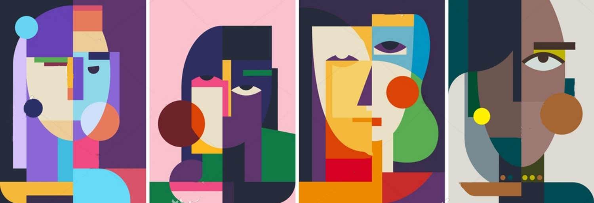
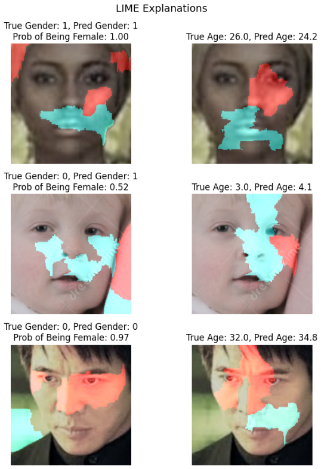

# Demographic Prediction from Facial Images

## Dataset

The dataset for this project can be found on [Kaggle](https://www.kaggle.com/datasets/jangedoo/utkface-new) (licensed under CC0: Data files © Original Authors).

The UTKFace dataset contains close-up facial images labeled with age, gender, and ethnicity, allowing for the development of models that predict multiple attributes simultaneously. It includes individuals from a wide range of ages and ethnic backgrounds.

The dataset challenges, including an uneven distribution of all three labels, which can introduce biases. It also contains duplicate images and occasional mislabeling, both of which can impact model performance.

## Objectives

Facial attribute prediction has applications in various fields:  

- Market Research & Analytics – Providing demographic insights in retail environments to help businesses refine marketing. This means showing targeted advertisements.
- Human-Computer Interaction – Adjusting user interfaces dynamically based for personalized experiences.  
- Healthcare & Demographics – Estimating missing demographic data for epidemiological studies or public health research.

The main objective of the project is:

> **Develop a multi-task convolutional neural network to predict age and gender from facial images.**

The objective was achieved through the following steps:  

- Identifying and handling duplicate images, mislabeling and other potential data quality issues.  
- Fine-tuning a pretrained CNN model for multi-task learning: gender classification and age regression.  
- Evaluating model performance, identifying biases, and exploring possible improvements.  

## Results 

The tested pre-trained CNN models were ResNet18 and ResNet34. The fine-tuning process involved two stages: first training the output layer, then fine-tuning all layers. The AdamW optimizer was used, along with MAE loss for age regression and Binary Cross Entropy for gender classification. Fine-tuning was done on the sum of both loss functions. Horizontal flip augmentation was applied. ResNet34 achieved a loss value 0.3 higher than ResNet18, with final losses of 5.1 and 4.8 respectively.  

> **The model achieves 92% accuracy in classifying gender (balanced classes), increasing to 95% when babies and toddlers are removed, as their gender is harder to predict from facial features. Age predictions have an average error of 4.7 years (MAE), with variations of approximately ±1 year across gender and ethnicity subgroups.**  

Model Bias:

- Model underpredicts age for older individuals. This pattern is consistent across genders and ethnicities. The average error (MAE) is 8 years for those over 45, while for younger individuals (45 and below), it is 3.7 years.
- Compared to other age ranges, young males (up to 17) have a much higher chance of being categorized as female. 
- Asian men have a comparatively high probability of being classified as female, nearly twice as high as the next highest probability among other ethnicity groups.

## Model Explainability

LIME visualization shows the parts of the image that influenced the model's decision. Cyan areas support the predicted class, while red areas oppose it.  

 

  

- The model focuses on biologically relevant features such as the jawline, eyebrows, and lips.  
- For both correct and incorrect predictions, various regions of the face are used.  
- In a some cases, the model incorporates background information.
